# TeamBlaze-DiscordEmotes

Discord bot for managing seasonal custom emotes for Team Blaze.

## Features

- Batch upload/update emotes from local folders to Discord
- Seasonal emote variants (base, fall, winter)
- Send custom messages to Discord via command line
- Automatic rate limiting to avoid Discord API limits

## Setup

1. Clone the repository
2. Create a virtual environment:
   ```bash
   python -m venv venv
   ```
3. Activate the environment:
   - Windows: `venv\Scripts\activate`
   - Linux/macOS: `source venv/bin/activate`
4. Install dependencies:
   ```bash
   pip install -r requirements.txt
   ```
5. Create a `.env` file with your configuration:
   ```
   DISCORD_TOKEN=your_bot_token
   GUILD_ID=your_server_id
   CHANNEL_ID=optional_notification_channel_id
   CURRENT_SEASON=base
   ```

## Usage

Update emotes for the current season:
```bash
python bot.py
```

Send a custom message to Discord:
```bash
python bot.py "Hello Team Blaze!"
```

Change seasons by updating `CURRENT_SEASON` in `.env` to `base`, `fall`, or `winter`.

## Emote Gallery

| Emote Name | Base | HD | Fall | HD | Winter | HD |
|------------|------|-----|------|-----|--------|-----|
| apes |  | Y | | | 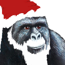 | Y |
| bait | 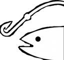 | Y | | | 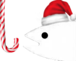 | |
| bigbrain |  | Y | | | | N/A |
| blz |  | Y | | | | N/A |
| bongocat | 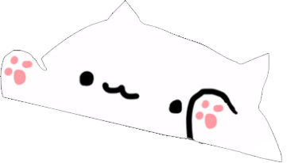 | Y | | |  | N |
| bonk | 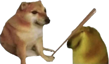 | | | | | N/A |
| boomer | 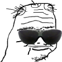 | Y | | |  | Y |
| comfycat | 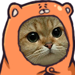 | Y |  | Y | 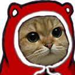 | Y |
| comfypepo |  | Y | 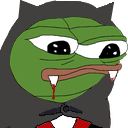 | Y | 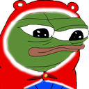 | Y |
| comfyyee | 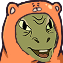 | Y | | |  | Y |
| copium | 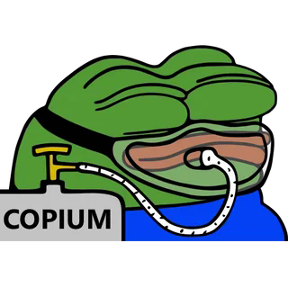 | N | | | 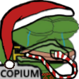 | |
| dafeels | | | 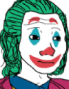 | N | 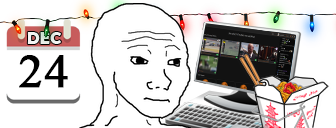 | N |
| dankmemes |  | Y | 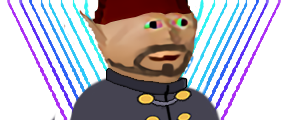 | Y |  | Y |
| facepalm |  | Y | | | | N/A |
| feelsbadman | 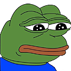 | N | 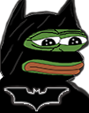 | N | 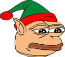 | N |
| feelsgoodman |  | N | 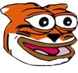 | N | 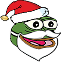 | N |
| gnome | 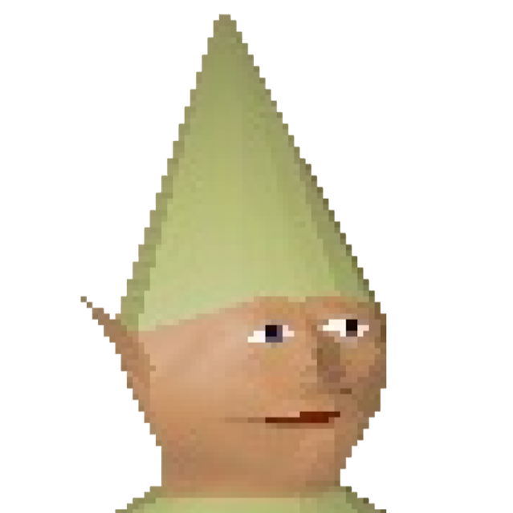 | Y | | | 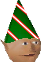 | Y |
| hahaa |  | Y | | | 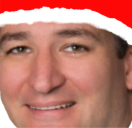 | Y |
| hhheheh | 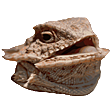 | Y | | |  | Y |
| hmm | 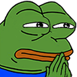 | Y |  | Y |  | Y |
| kekw | 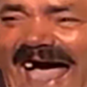 | N | | | 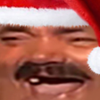 | |
| loggers | 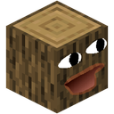 | Y | | | | |
| lul |  | Y | | |  | Y |
| monkas |  | | | |  | |
| nobully |  | Y | | | 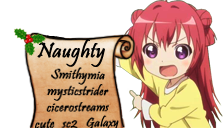 | Y |
| overrustled | 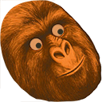 | Y | | | 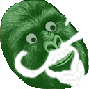 | Y |
| pepehands |  | Y |  | Y |  | Y |
| pepejoke |  | | | | | |
| pepelaugh |  | Y |  | Y | 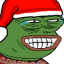 | Y |
| peperat | 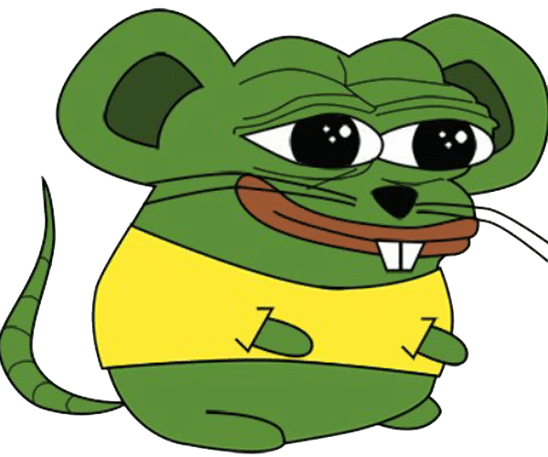 | Y | | | | |
| pepohmm |  | Y |  | Y | 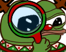 | Y |
| pepojams |  | Y | | |  | |
| peposlash | 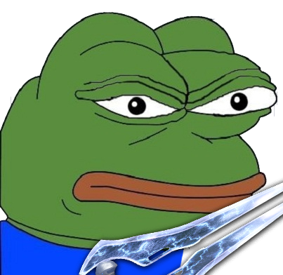 | Y | 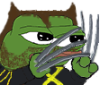 | N | 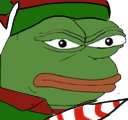 | Y |
| pepostonks |  | Y | | | | |
| pepowant | 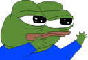 | Y | 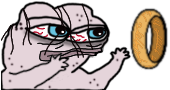 | N |  | N |
| pepoweird |  | Y | 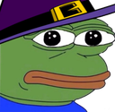 | Y | 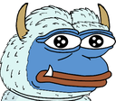 | Y |
| pikohh |  | Y |  | Y |  | Y |
| poggers |  | Y | 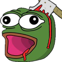 | Y |  | Y |
| potato | 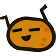 | Y |  | Y | 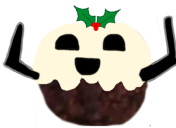 | Y |
| pepe | | | | | 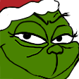 | |
| ree |  | Y | | | 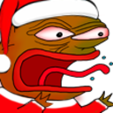 | Y |
| sidd |  | Y | | | | |
| surprise | 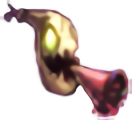 | N | | | | |
| sweaty | 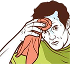 | Y | 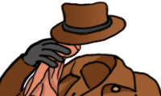 | | | |
| tendies |  | Y | | | | |
| thinkies |  | N |  | N |  | N |
| whataburger |  | Y | | | | |
| wow |  | Y | | |  | |
| yee |  | Y | | |  | Y |
| yellingwoman |  | Y | | | | |
| zoomer |  | Y | | |  | Y |

### Animated Emotes

| Emote Name | Base | Fall | Winter |
|------------|------|------|--------|
| huhh |  | | |
| ratjam |  |  |  |
