# TeamBlaze-DiscordEmotes

| Emote Name | Base | HD | Fall | HD | Winter | HD |
|------------|----|----|------|----|--------|----|
| apes |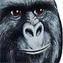  | Y |  | Y |   | Y|"
| badcat |  | N/A |  |  |   | |"
| bigbrain |  | Y |  |  |   | |"
| blz |  | Y |  | N/A |   | N/A|"
| bongocat |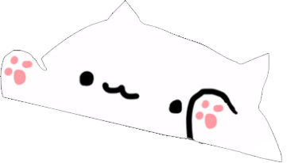  | Y |  |  |   | N|"
| bonk |  |  |  |  |   | |"
| boomer |  | Y |  | N/A | 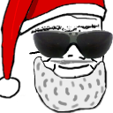  | Y|"
| comfycat |  | Y |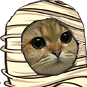  | Y |   | Y|"
| comfypepo |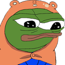  | Y |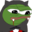  | N |   | Y|"
| comfyyee |  | Y |  |  | 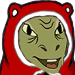  | Y|"
| copium |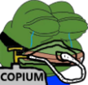  |  |  |  |   | |"
| dafeels |  |  |  |  |   | |"
| dankmemes |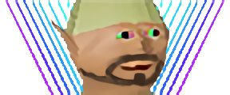  |  |  |  | 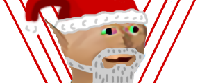  | |"
| facepalm |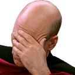  | Y |  | N/A |   | N/A|"
| feelsbadman |  |  |  |  |   | |"
| feelsgoodman |  |  |  |  |   | |"
| gnome |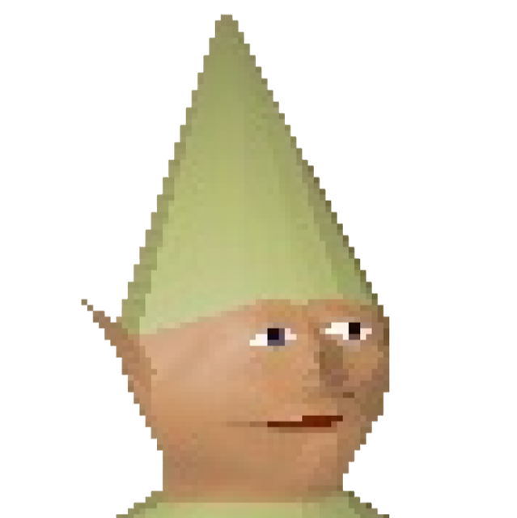  |  |  |  |   | |"
| hahaa |  | Y |  | N/A |   | Y|"
| hhheheh |  | Y |  |  | 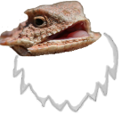  | Y|"
| hmmm |  |  |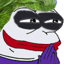  |  | 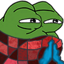  | |"
| kekw |  |  |  |  |   | |"
| lul |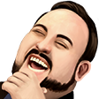  | Y |  |  | 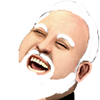  | Y|"
| monkas |  |  |  |  | 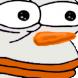  | |"
| nobully |  | Y |  |  |   | Y|"
| overrustled |  | Y |  |  |   | Y|"
| pepehands |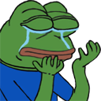  |  |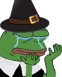  |  | 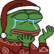  | |"
| pepejoke |  |  |  |  |   | |"
| pepelaugh |  | Y |  | Y |   | Y|"
| peperat |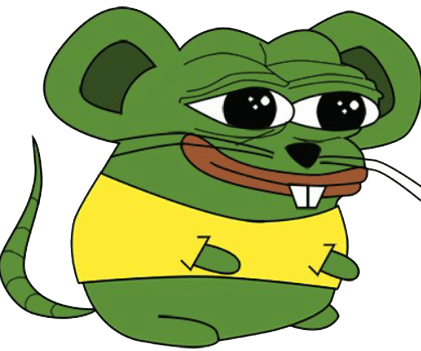  | Y |  |  |   | |"
| pepo |  |  |  |  |   | |"
| pepohmm |  |  |  |  | 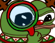  | |"
| pepojams |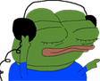  |  |  |  | 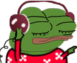  | |"
| peposlash |  | Y |  | N |   | |"
| pepostonks |  | Y |  |  |   | |"
| pepowant |  |  |  |  | 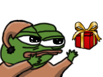  | |"
| pepoweird |  |  |  |  |   | |"
| pikohh |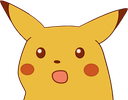  | Y |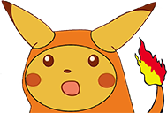  | Y | 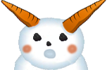  | Y|"
| poggers |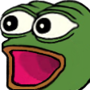  | Y |  | Y | 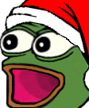  | Y|"
| potato |  | Y |  | Y |   | Y|"
| Quakecon |  |  |  |  |   | |"
| ree |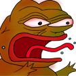  |  |  |  | 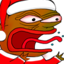  | |"
| shadowrealm |  |  |  |  |   | |"
| sidd |  |  |  |  |   | |"
| SURPRISE |  | N |  |  |   | |"
| sweaty |  | Y |  |  |   | |"
| tendies |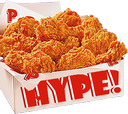  | Y |  |  |   | |"
| thinkies |  |  |  |  | 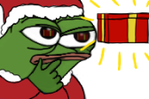  | |"
| whataburger |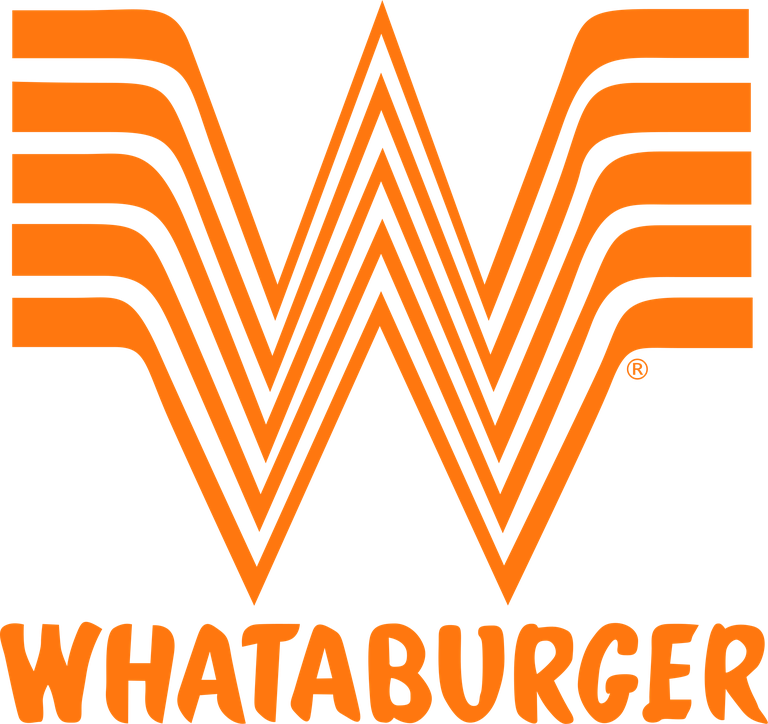  |  |  |  |   | |"
| wow |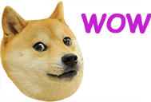  |  |  |  |   | |"
| yee |  | Y |  |  | 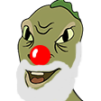  | Y|"
| yellingwoman |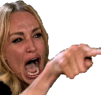  |  |  |  |   | |"
| zoomer |  | Y |  |  |   | Y|"